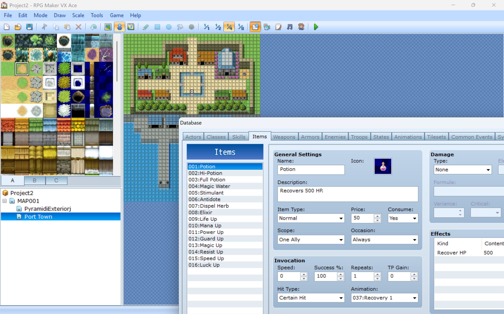

# {{frontmatter.title}}

## What is turn based combat?

Turn based RPGs used to be one of my favorite genres.
If you have not played one, you've definitely heard about games with turn based combat.
Older titles include pokemon, any RPG Maker game, Final Fantasy series and The Legend of Heros Trails series.
Some more recent ones are Fate Grand Order, the Persona series, Honkai Starrail, and Claire Obscura Expedition 33.

## RPG Maker brief intro

When I didn't know how to code, I came across a framework called RPG Maker.
This framework has built-in assets for ground, building, and characters.
It renders the world in a 2d side view (Research this part?) (like pokemon)
You can interact with a graphical UI to create a game world by selecting what asset tile to place for a specific square.


It comes with a simple turn based engine by default, with a wide range of pre-defined abilities and classes for the characters.
It was really easy to define new abilities and adjust the numbers/ratios, just like editing an excel spreadsheet.
RPG Maker made it possible to make a simple turn based game within minutes.
I fell in love with this tool and made several games.
They were all really simple, linear games with about 5min of play time.

## Turn based combat turns out to be non-trivial!

As I mentioned in the previous blog, my first game was a top down shooter in Unity.
Why did I not make a turn based game, if I've already made one using RPG Maker?
Well, I brainstormed about the turn based combat states, and found it really difficult to manage, especially because I was thinking in terms of Unity's paradigm: do something in each `Update()` call every second.
I found it hard to reason about the game state back then.

So finally, I made a turn based combat proof of concept on [my personal website](http://localhost:5173/#/games/starrail).
I followed the popular game Honkai Starrail, where there is a timeline on the left hand side, showing the turn order. 
After a unit takes their turn, they are placed into a 10000m runway and run towards the finish line. The unit that crosses the finish line first get to take the turn.

The interesting piece is turn state. This tracks the ongoing gamestate to inform the renderer what to display on screen, and also tells the turn manager how to proceed with the next piece of action (a turn).

```typescript
export enum TurnStateEnum {
  EMPTY = 'empty',
  ENEMY_TURN = 'enemy_turn',
  PLAYER_TURN_DEFAULT = 'default',
  PLAYER_TURN_SKILL_PENDING = 'skill pending',
  PLAYER_ULT_PENDING = 'ult pending'
}

export class GameState {
  cameraState: CameraState
  turnState: TurnState = { stateEnum: TurnStateEnum.EMPTY, resolvingSubTurn: false }
  turnCharacter: Character | null = null
  queue: TimelineTurn[]
  ...
}
```

Check out the full code on [my github!](https://github.com/PaperbagLife/PaperbagLife.github.io/tree/master/vue-version/src/util/starrail)

It took a lot of planning on paper to figure out how the classes should be managed, what the main turn resolution looks like, and what the transition from each state to another looks like in code.
This is a very important lesson: If you fail to plan, you plan to fail.

Previously, I built my games bit by bit, wrote out exact details for a few functions and see what the game looked like.
Then, I implement features like applying bandages or tape on top of a falling tower.

If you read the code above, you would notice that the `resolveTurn` function is one big abomination. 
It's the result of not fully planning out every detail between state transitions, and having to add lines to fix some weird behaviors as I tested.

From now on, I think I should focus on making the big idea functions, place them together to see if they make sense, then work out the details for each function. Top-down design seems easier for game design.